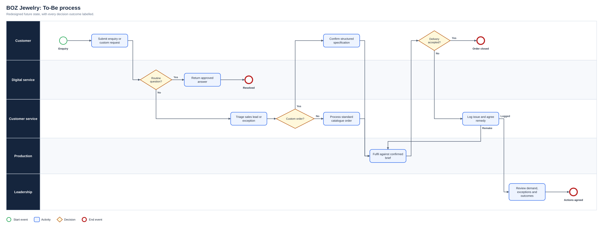
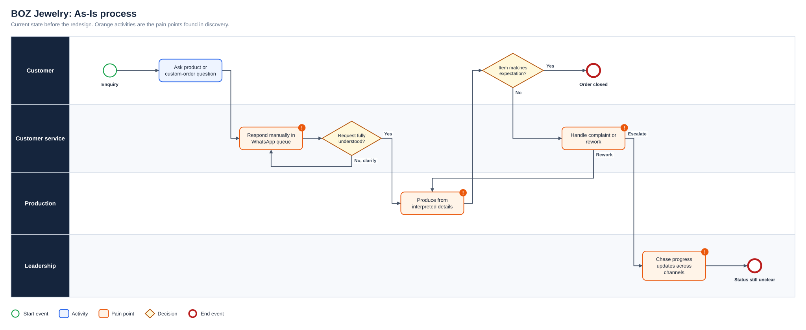
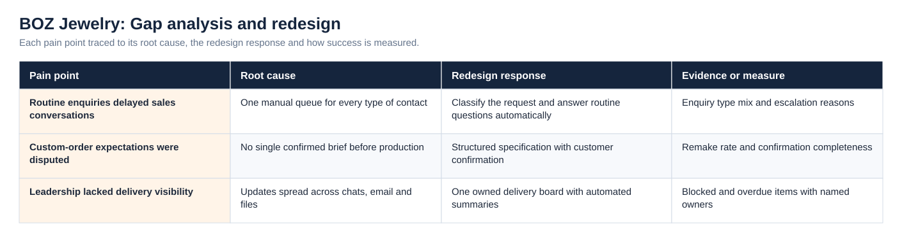
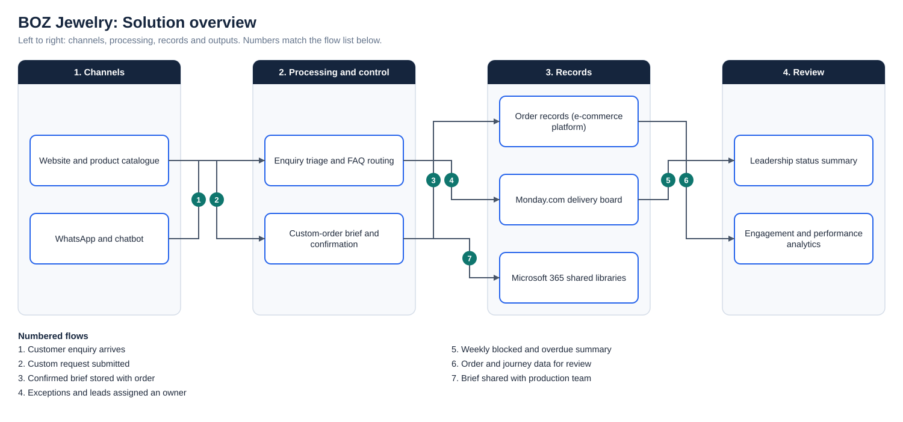

# BOZ Jewelry: Retail and E-commerce Transformation

**Status:** Delivered  
**Business domain:** Retail and e-commerce  
**Solution domain:** Digital transformation, process improvement and business systems  
**Role:** IT Project Manager / E-commerce Manager with Business Analysis responsibilities

## Executive summary

BOZ Jewelry needed to improve its digital retail experience and strengthen the internal systems supporting delivery. The work combined e-commerce improvement, stakeholder coordination, Microsoft 365 implementation, project visibility and customer-journey analysis.

The central challenge was not simply selecting technology. Business owners, developers, creatives, customer-facing colleagues and external providers needed a shared understanding of priorities, costs, security, functionality and operational impact.

## Business problems

- Fragmented project updates and unclear ownership
- Limited visibility of milestones, dependencies, risks and decisions
- Customer friction across product discovery, ordering and custom-order expectations
- Repetitive customer-service questions that reduced time available for qualified sales enquiries
- Different levels of confidence in new workplace technology

## Analysis and delivery contribution

I conducted stakeholder discussions to understand business priorities, user needs and constraints. I documented workflows and data needs across website design, catalogue management, checkout and internal-system workstreams. Technical options were translated into business language so stakeholders could assess cost, security, feasibility, user impact and administrative effort.

I introduced Monday.com-based task ownership and automated reporting, creating a consolidated view of milestones, dependencies, risks and outstanding decisions. During the Microsoft 365 rollout, I used demonstrations and step-by-step support, then gathered feedback to identify genuine user needs and confidence gaps.

For the customer journey, I investigated recurring enquiries and custom-order dissatisfaction. This informed the introduction of an AI chatbot for repeat questions and a dedicated custom-order experience intended to improve requirement capture and alignment between customer expectations and delivered products.

## Requirements examples

| ID | Requirement | Priority | Objective | Acceptance criterion |
|---|---|---|---|---|
| BR-01 | Leadership can view project status, ownership and blockers in one place | Must | OBJ-01 | Every active item shows owner, status, due date and dependency |
| BR-02 | Authorised colleagues can access controlled shared information | Must | OBJ-03 | Current documents are accessible according to role; unauthorised access is denied |
| BR-03 | Customers receive consistent answers to common questions | Should | OBJ-02 | An approved answer is returned, or the query is escalated to a person |
| BR-04 | Custom-order specifications are confirmed before fulfilment | Must | OBJ-02 | Required details and customer confirmation are recorded before production starts |
| BR-05 | Changes are tested with business users before release | Must | OBJ-04 | Agreed scenarios pass and exceptions are logged and retested |

Full traceability is in the [Requirements Traceability Matrix](Docs/Requirements_Traceability_Matrix.pdf).

## Process view

The As-Is process and the full diagram set are shown under Diagrams below.

## Outcomes

Subsequent improvements contributed to a reported **60% increase in engagement** and **25% improvement in digital performance**. The work also improved visibility of delivery responsibilities and strengthened the basis for evaluating customer experience after implementation.

## Competencies demonstrated

Stakeholder management · requirements elicitation · process mapping · change support · options assessment · UAT · customer-journey analysis · benefits evaluation

## Supporting artefact

- [Business Analysis Pack](BUSINESS_ANALYSIS_PACK.md)

## Diagrams

**To-Be process**

**As-Is process**

**Gap analysis and redesign**

**Solution overview**

## Project artefact library

| Artefact | Purpose |
|---|---|
| [Executive deck (PDF)](Deck/Executive_Deck.pdf) | Problem, discovery findings, As-Is and To-Be, change summary, evidence and recommendations |
| [Executive deck (PowerPoint)](Deck/Executive_Deck.pptx) | Editable version of the deck |
| [Business Requirements Document](Docs/BRD.pdf) | Objectives, scope, business requirements, assumptions, constraints and risks |
| [Functional Requirements Document](Docs/FRD.pdf) | System behaviour, business rules, user stories and non-functional requirements |
| [Requirements Traceability Matrix](Docs/Requirements_Traceability_Matrix.pdf) | Objective to requirement to functional requirement, user story and test |
| [UAT and Validation Plan](Docs/UAT_and_Validation_Plan.pdf) | Given, When, Then scenarios with status and exit criteria |
| [Stakeholder Engagement Plan](Docs/Stakeholder_Engagement_Plan.pdf) and [Communications Plan](Docs/Communications_Plan.pdf) | Influence and interest analysis, methods and cadence |
| [MoSCoW Prioritisation](Docs/MoSCoW_Prioritisation.pdf) | Must, Should, Could and Won’t with rationale |
| [Data Dictionary](Docs/Data_Dictionary.pdf) | Field definitions and allowed values ([CSV](Data/Data_Dictionary.csv)) |
| [Project workbook](Excel/Project_Workbook.xlsx) | Requirements, functional requirements, stories, stakeholders, RAID, UAT and traceability, with formula-driven counts |
| [Evidence overview](Dashboard/Project_Evidence_Overview.png) | Requirements by priority, tests by status and risks by severity |
