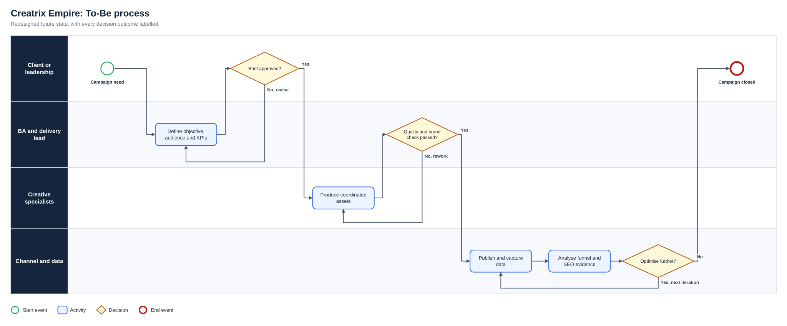
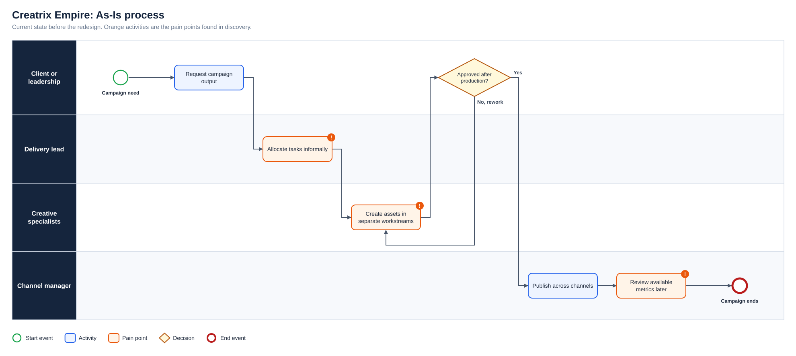
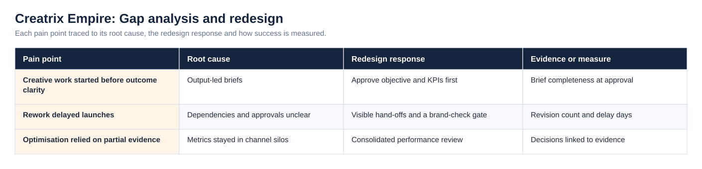
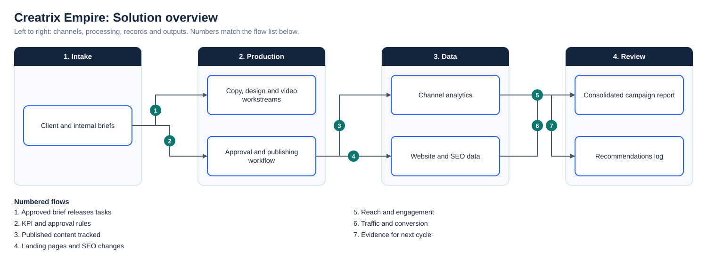

# Creatrix Empire: Marketing Operations and Performance Analysis

**Status:** Delivered  
**Business domain:** Digital marketing, media and entertainment  
**Solution domain:** Operating-model improvement and performance analysis  
**Role:** Digital Marketing Analyst / Delivery Lead

## Business context

The organisation needed to support diverse client and in-house marketing requirements with clearer specialist ownership. Work included external campaigns and internal brands such as a recording studio and Afrobeatsglobal.

## Contribution

I supported the digital transformation of the marketing function by helping establish a multidisciplinary delivery structure involving copywriting, graphic design, video editing and social-media management. I coordinated workflows, clarified hand-offs and supervised digital marketing activities across different client needs.

I consolidated reach, engagement, website traffic and conversion information to identify stronger channels and content formats. Recommendations informed campaign changes that contributed to a reported **45% increase in engagement**. I also investigated weak organic acquisition using keyword, content and website-performance analysis, helping prioritise SEO improvements associated with approximately **150% growth in organic traffic**.

## Process improvement

The As-Is process and the full diagram set are shown under Diagrams below.

## BA capabilities demonstrated

- Stakeholder and expectation management
- Workflow and responsibility design
- Data consolidation and KPI interpretation
- Root-cause investigation of weak acquisition
- Evidence-based recommendations
- Iterative improvement across campaign cycles

## Integrity note

This case study reflects verified responsibilities and recorded high-level outcomes. Client-level commercial data and internal campaign records are not published.

## Diagrams

**To-Be process**

**As-Is process**

**Gap analysis and redesign**

**Solution overview**

## Project artefact library

| Artefact | Purpose |
|---|---|
| [Executive deck (PDF)](Deck/Executive_Deck.pdf) | Problem, discovery findings, As-Is and To-Be, change summary, evidence and recommendations |
| [Executive deck (PowerPoint)](Deck/Executive_Deck.pptx) | Editable version of the deck |
| [Business Requirements Document](Docs/BRD.pdf) | Objectives, scope, business requirements, assumptions, constraints and risks |
| [Functional Requirements Document](Docs/FRD.pdf) | System behaviour, business rules, user stories and non-functional requirements |
| [Requirements Traceability Matrix](Docs/Requirements_Traceability_Matrix.pdf) | Objective to requirement to functional requirement, user story and test |
| [UAT and Validation Plan](Docs/UAT_and_Validation_Plan.pdf) | Given, When, Then scenarios with status and exit criteria |
| [Stakeholder Engagement Plan](Docs/Stakeholder_Engagement_Plan.pdf) and [Communications Plan](Docs/Communications_Plan.pdf) | Influence and interest analysis, methods and cadence |
| [MoSCoW Prioritisation](Docs/MoSCoW_Prioritisation.pdf) | Must, Should, Could and Won’t with rationale |
| [Data Dictionary](Docs/Data_Dictionary.pdf) | Field definitions and allowed values ([CSV](Data/Data_Dictionary.csv)) |
| [Project workbook](Excel/Project_Workbook.xlsx) | Requirements, functional requirements, stories, stakeholders, RAID, UAT and traceability, with formula-driven counts |
| [Evidence overview](Dashboard/Project_Evidence_Overview.png) | Requirements by priority, tests by status and risks by severity |
