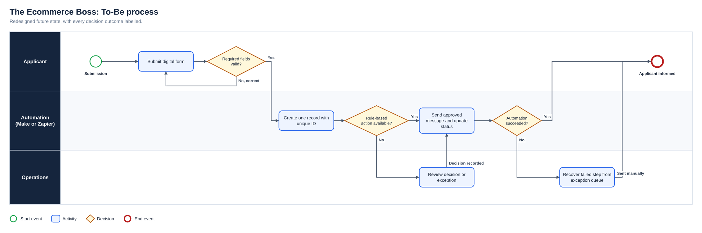
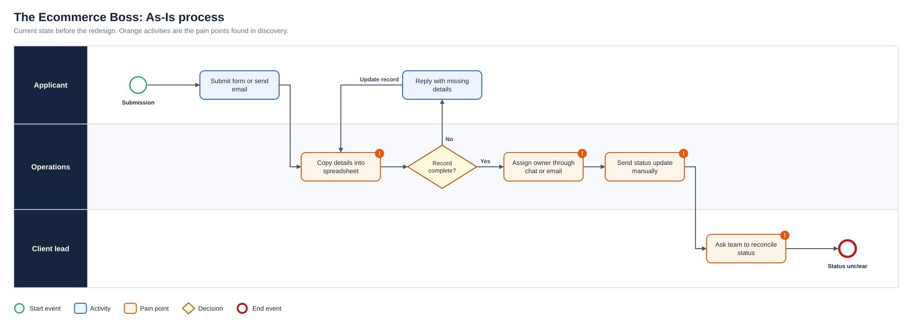
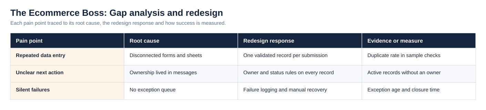
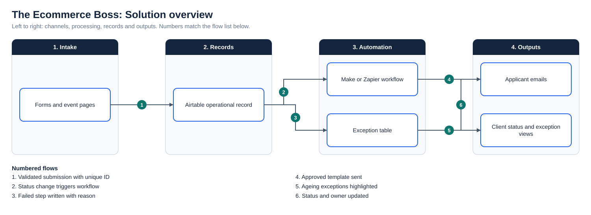

# The Ecommerce Boss: Event Operations Automation

**Status:** Delivered across client engagements  
**Business domain:** E-commerce, events and digital services  
**Solution domain:** Process improvement, workflow automation and digital delivery  
**Role:** Founder / Digital Business Analyst

## Business problem

Event clients frequently managed registrations, vendor applications and customer communications through disconnected forms, spreadsheets and email exchanges. The visible request was often “build a website,” but discovery identified deeper operational issues:

- duplicated data entry;
- unclear ownership;
- inconsistent hand-offs;
- limited visibility of application status;
- manual and repetitive communications.

## Approach

I established the business objective, users, current workflow and constraints with organisers and delivery colleagues. I mapped where information was created, transferred, reviewed or lost, then designed to-be workflows connecting forms, Airtable records, automated email, Make and Zapier.

I translated the journeys into functional requirements, user stories, acceptance criteria and prioritised backlogs. Options were assessed against cost, technical feasibility, data quality, user experience and ongoing administrative effort rather than recommending automation by default.

## Generic to-be pattern

The As-Is process and the full diagram set are shown under Diagrams below.

## Validation

Tests covered form submission, registration, confirmation email, database update and reporting journeys. Defects were documented with reproduction steps and corrections were retested before release.

## Business value

The work created clearer ownership, more consistent communications, improved data traceability and better visibility of operational status.

## Diagrams

**To-Be process**

**As-Is process**

**Gap analysis and redesign**

**Solution overview**

## Project artefact library

| Artefact | Purpose |
|---|---|
| [Executive deck (PDF)](Deck/Executive_Deck.pdf) | Problem, discovery findings, As-Is and To-Be, change summary, evidence and recommendations |
| [Executive deck (PowerPoint)](Deck/Executive_Deck.pptx) | Editable version of the deck |
| [Business Requirements Document](Docs/BRD.pdf) | Objectives, scope, business requirements, assumptions, constraints and risks |
| [Functional Requirements Document](Docs/FRD.pdf) | System behaviour, business rules, user stories and non-functional requirements |
| [Requirements Traceability Matrix](Docs/Requirements_Traceability_Matrix.pdf) | Objective to requirement to functional requirement, user story and test |
| [UAT and Validation Plan](Docs/UAT_and_Validation_Plan.pdf) | Given, When, Then scenarios with status and exit criteria |
| [Stakeholder Engagement Plan](Docs/Stakeholder_Engagement_Plan.pdf) and [Communications Plan](Docs/Communications_Plan.pdf) | Influence and interest analysis, methods and cadence |
| [MoSCoW Prioritisation](Docs/MoSCoW_Prioritisation.pdf) | Must, Should, Could and Won’t with rationale |
| [Data Dictionary](Docs/Data_Dictionary.pdf) | Field definitions and allowed values ([CSV](Data/Data_Dictionary.csv)) |
| [Project workbook](Excel/Project_Workbook.xlsx) | Requirements, functional requirements, stories, stakeholders, RAID, UAT and traceability, with formula-driven counts |
| [Evidence overview](Dashboard/Project_Evidence_Overview.png) | Requirements by priority, tests by status and risks by severity |
