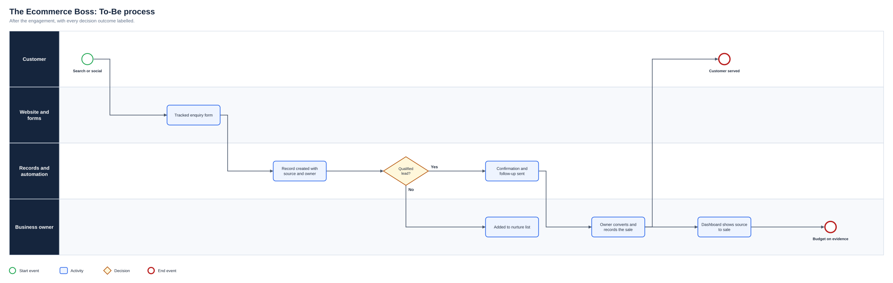
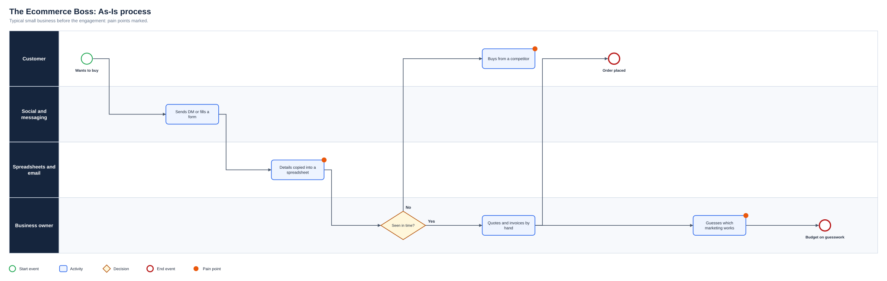
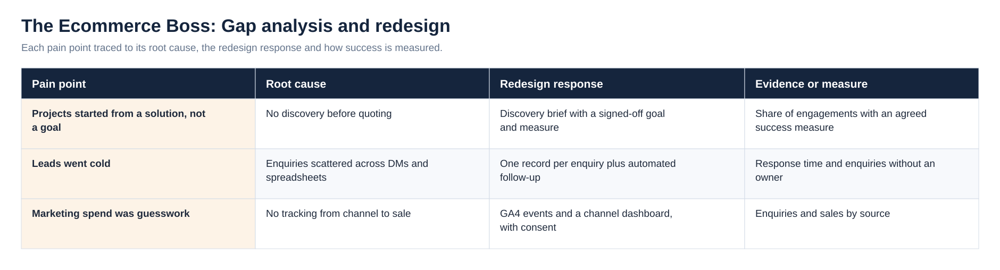
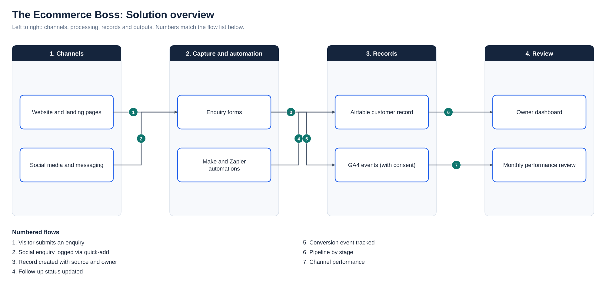

# The Ecommerce Boss: Business Analysis Consulting for Small Businesses

**Status:** Ongoing (2024 to present)  
**Business domain:** SME digital services: marketing operations and web development  
**Solution domain:** Discovery, requirements, process design and delivery for small-business digital projects  
**Role:** Business Analyst

## Executive summary

The Ecommerce Boss is my business-analysis consultancy for small businesses and SMEs. Owners come to me for help with marketing operations and web development, usually with a solution already in mind: a new website, an online shop or more sales from social media.

My job is to find the problem behind the request. I agree the goal and how success will be measured, map how customers and enquiries actually flow through the business, prioritise what the budget can deliver, and make sure the finished website or tool is tested, measurable and something the owner can run without me.

## Business problems

- Requests arrive as solutions (“we need a website”) before the goal is agreed
- Enquiries are scattered across direct messages, forms and spreadsheets, so follow-ups are missed
- Marketing tasks, content and campaigns run without a clear workflow or owner
- Owners cannot see what their marketing or website returns
- Budgets are tight, so every feature has to earn its place

## Analysis and delivery contribution

Every engagement starts with discovery. I run a short workshop with the owner to agree the goal, the users and one measure of success, then map the As-Is process from first enquiry to paid order. That map usually shows the real problem is not the website itself but what happens to an enquiry after it arrives.

I then write requirements, user stories and acceptance criteria, and prioritise them with MoSCoW so the Must items fit the budget. Delivery connects the owner's website (WordPress or Shopify) to a single customer record in Airtable, with Make or Zapier handling confirmations and follow-ups, GA4 tracking the actions that matter, and consent managed properly. I test every change with the owner before go-live and hand over a guide so their team can run it.

## How an engagement runs

| Stage | What happens |
|---|---|
| 1. Discover | Workshop with the owner to agree the goal, users, constraints and one success measure; map the As-Is process |
| 2. Define | Requirements, user stories and acceptance criteria, prioritised with MoSCoW against the budget |
| 3. Build | Website, forms, records and automations configured with the owner's platforms (WordPress, Shopify, Airtable, Make, Zapier, GA4) |
| 4. Test | UAT with the owner on agreed scenarios; issues logged, fixed and retested before go-live |
| 5. Hand over | Guide, walkthrough and a monthly review of performance by channel |

## Requirements examples

| ID | Requirement | Priority | Objective | Acceptance criterion |
|---|---|---|---|---|
| BR-01 | Each engagement starts with a discovery brief the owner agrees | Must | OBJ-01 | Goal, users, constraints and success measure are written down and signed off before build |
| BR-02 | Scope is prioritised against the budget | Must | OBJ-02 | Must items fit the budget; Should, Could and Won't items are recorded with reasons |
| BR-03 | Enquiries from every channel land in one record | Must | OBJ-03 | Website, form and social enquiries create a record with source, status and owner |
| BR-04 | Routine follow-ups are automated | Should | OBJ-03 | Confirmations and reminders send without manual copying |
| BR-05 | Websites and campaigns are measurable, with consent | Must | OBJ-04 | Key actions are tracked in GA4 and tags load only after consent |

Full traceability is in the [Requirements Traceability Matrix](Docs/Requirements_Traceability_Matrix.pdf).

## Process view

The As-Is process and the full diagram set are shown under Diagrams below.

## Outcomes

Owners who arrived asking for a website leave with an agreed goal, a scope that fits their budget, one record for every enquiry with automated follow-up, and a way to see which channels bring customers. Client results belong to each business and are not published.

## Competencies demonstrated

Discovery · stakeholder management · process mapping · requirements and acceptance criteria · MoSCoW prioritisation · marketing operations · web delivery · workflow automation · UAT · handover and training

## Supporting artefact

- [Business Analysis Pack](BUSINESS_ANALYSIS_PACK.md)

## Diagrams

**To-Be process**

**As-Is process**

**Gap analysis and redesign**

**Solution overview**

## Project artefact library

| Artefact | Purpose |
|---|---|
| [Executive deck (PDF)](Deck/Executive_Deck.pdf) | Problem, discovery findings, As-Is and To-Be, change summary, evidence and recommendations |
| [Executive deck (PowerPoint)](Deck/Executive_Deck.pptx) | Editable version of the deck |
| [Business Requirements Document](Docs/BRD.pdf) | Objectives, scope, business requirements, assumptions, constraints and risks |
| [Functional Requirements Document](Docs/FRD.pdf) | System behaviour, business rules, user stories and non-functional requirements |
| [Requirements Traceability Matrix](Docs/Requirements_Traceability_Matrix.pdf) | Objective to requirement to functional requirement, user story and test |
| [UAT and Validation Plan](Docs/UAT_and_Validation_Plan.pdf) | Given, When, Then scenarios with status and exit criteria |
| [Stakeholder Engagement Plan](Docs/Stakeholder_Engagement_Plan.pdf) and [Communications Plan](Docs/Communications_Plan.pdf) | Influence and interest analysis, methods and cadence |
| [MoSCoW Prioritisation](Docs/MoSCoW_Prioritisation.pdf) | Must, Should, Could and Won’t with rationale |
| [Data Dictionary](Docs/Data_Dictionary.pdf) | Field definitions and allowed values ([CSV](Data/Data_Dictionary.csv)) |
| [Project workbook](Excel/Project_Workbook.xlsx) | Requirements, functional requirements, stories, stakeholders, RAID, UAT and traceability, with formula-driven counts |
| [Evidence overview](Dashboard/Project_Evidence_Overview.png) | Requirements by priority, tests by status and risks by severity |
