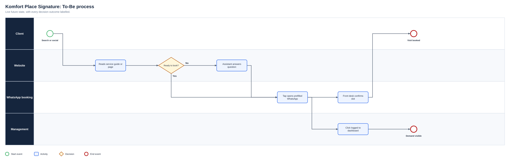
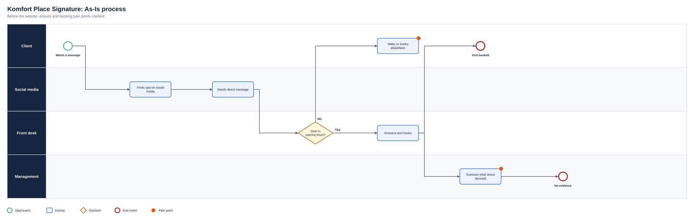
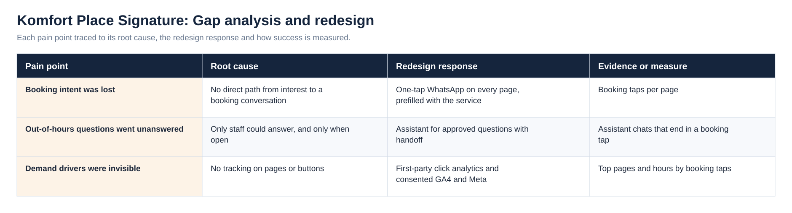
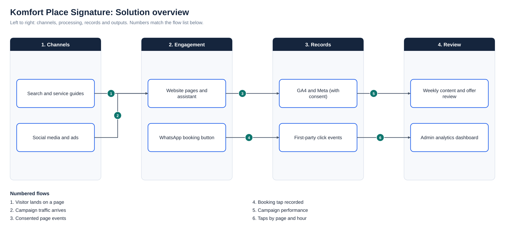

# Komfort Place Signature: Spa Website, Booking Funnel and Analytics

**Status:** Live  
**Business domain:** Wellness and hospitality  
**Solution domain:** Digital service design, conversion and analytics  
**Role:** Digital Product Lead and Business Analyst

## Executive summary

Komfort Place Signature is a premium massage and wellness spa in Lekki, Lagos. Before this work, clients found the spa on social media and booked by direct message. There was no website funnel, no view of which services or pages drove enquiries, and nobody to answer questions outside opening hours.

I designed and delivered the digital service between May and August 2026: a mobile-first website that turns every page into a one-tap WhatsApp booking, a chat assistant for common questions, local search content, loyalty rewards and first-party analytics that show management where bookings start.

## Business problems

- Booking intent was lost between finding a service and starting a conversation
- Questions asked outside opening hours went unanswered
- No data on which pages, services or buttons produced enquiries
- Little visibility in local searches such as “massage in Lekki”
- No structured reason for clients to come back

## Analysis and delivery contribution

I ran discovery with the owners on how clients found and booked the spa, mapped the As-Is enquiry journey and identified where intent was lost. I then defined the To-Be funnel: booking on WhatsApp because that is where the front desk already works, rather than adding a booking engine nobody would run.

I directed the build through an AI-assisted development platform, writing each change as a requirement with acceptance criteria and reviewing the result before release, across more than 390 recorded changes. I specified the click-event data model and the analytics dashboard, planned the SEO content, reviewed articles against search and advertising policies (withdrawing one that did not comply), and put GA4 and Meta Pixel behind cookie consent.

## How it evolved

| Period | What was delivered |
|---|---|
| May 2026 | Site built: services, VIP rooms, reviews carousel, loyalty card and About timeline |
| Jun 2026 | Full SEO optimisation |
| Jul 2026 | WhatsApp widget and sticky booking button, promo banner, interactive therapist page, chat assistant, blog, click tracking with admin view, GA4, cookie consent and Meta Pixel |
| Aug 2026 | SEO audit fixes, sitelink signals, more guides, page-view tracking and a redesigned analytics dashboard with a Today view, Spin & Win next-visit reward |

## Requirements examples

| ID | Requirement | Priority | Objective | Acceptance criterion |
|---|---|---|---|---|
| BR-01 | Every page offers one-tap WhatsApp booking | Must | OBJ-01 | A booking button is always visible on mobile and opens WhatsApp with a prefilled message |
| BR-02 | Common questions are answered at any hour | Should | OBJ-01 | The assistant answers approved FAQs and hands the visitor to WhatsApp to book |
| BR-03 | Booking clicks and page views are recorded first-party | Must | OBJ-02 | Each event stores name, label, page, referrer and session; the admin dashboard filters by range, including today by hour |
| BR-04 | Each service and the location have indexable content | Must | OBJ-03 | Sitemap, meta and share tags, structured data and breadcrumbs are present and submitted to Search Console |
| BR-05 | Repeat visits are rewarded | Should | OBJ-04 | Loyalty card rules are published and the Spin & Win reward leads to a booking message |

Full traceability is in the [Requirements Traceability Matrix](Docs/Requirements_Traceability_Matrix.pdf).

## Process view

The As-Is process and the full diagram set are shown under Diagrams below.

## Outcomes

The site is live with one-tap WhatsApp booking on every page, an assistant for out-of-hours questions, 14 local search guides and a dashboard showing booking taps by page and hour. It took four months to go from first build to a measured booking funnel. Booking and revenue figures belong to the business and are not published.

## Competencies demonstrated

Discovery · customer-journey mapping · requirements for AI-assisted delivery · analytics and data design · SEO planning · content governance · privacy and consent · stakeholder management

## Supporting artefact

- [Business Analysis Pack](BUSINESS_ANALYSIS_PACK.md)

## Diagrams

**To-Be process**

**As-Is process**

**Gap analysis and redesign**

**Solution overview**

## Project artefact library

| Artefact | Purpose |
|---|---|
| [Executive deck (PDF)](Deck/Executive_Deck.pdf) | Problem, discovery findings, As-Is and To-Be, change summary, evidence and recommendations |
| [Executive deck (PowerPoint)](Deck/Executive_Deck.pptx) | Editable version of the deck |
| [Business Requirements Document](Docs/BRD.pdf) | Objectives, scope, business requirements, assumptions, constraints and risks |
| [Functional Requirements Document](Docs/FRD.pdf) | System behaviour, business rules, user stories and non-functional requirements |
| [Requirements Traceability Matrix](Docs/Requirements_Traceability_Matrix.pdf) | Objective to requirement to functional requirement, user story and test |
| [UAT and Validation Plan](Docs/UAT_and_Validation_Plan.pdf) | Given, When, Then scenarios with status and exit criteria |
| [Stakeholder Engagement Plan](Docs/Stakeholder_Engagement_Plan.pdf) and [Communications Plan](Docs/Communications_Plan.pdf) | Influence and interest analysis, methods and cadence |
| [MoSCoW Prioritisation](Docs/MoSCoW_Prioritisation.pdf) | Must, Should, Could and Won’t with rationale |
| [Data Dictionary](Docs/Data_Dictionary.pdf) | Field definitions and allowed values ([CSV](Data/Data_Dictionary.csv)) |
| [Project workbook](Excel/Project_Workbook.xlsx) | Requirements, functional requirements, stories, stakeholders, RAID, UAT and traceability, with formula-driven counts |
| [Evidence overview](Dashboard/Project_Evidence_Overview.png) | Requirements by priority, tests by status and risks by severity |
