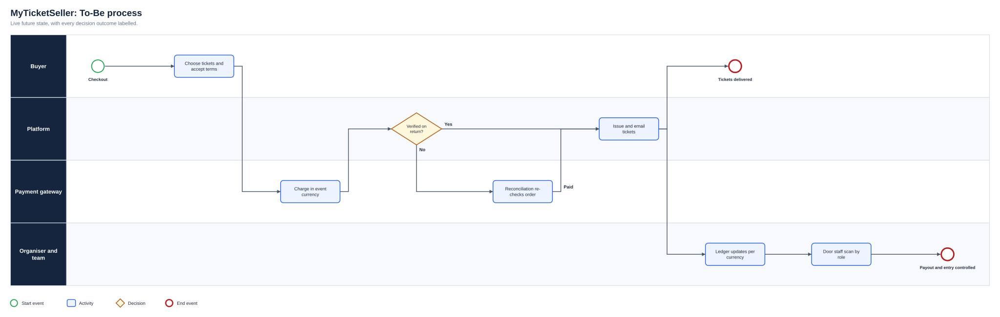
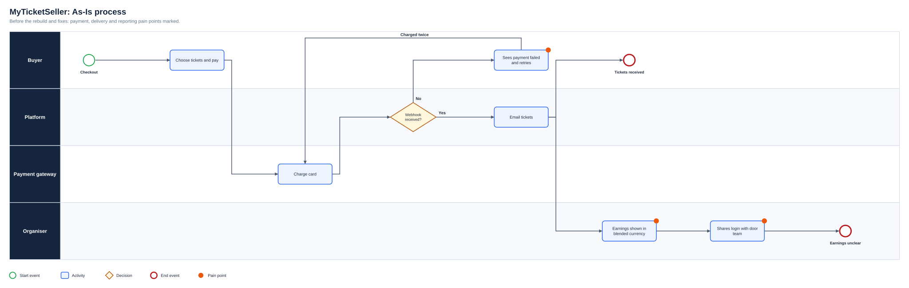
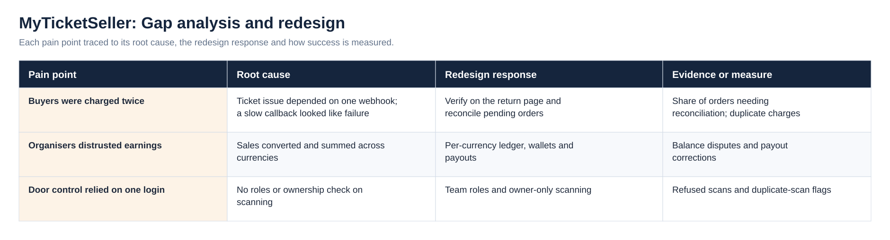
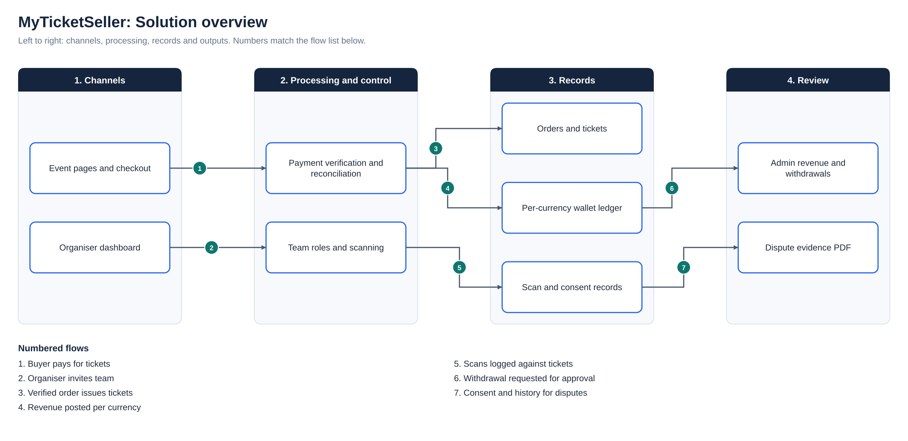

# MyTicketSeller: Event Ticketing Platform, Built From Scratch to Live

**Status:** Live  
**Business domain:** Event technology and payments  
**Solution domain:** Product ownership, requirements engineering and platform delivery  
**Role:** Product Owner and Business Analyst, HunterTV Africa

## Executive summary

MyTicketSeller is a live event-ticketing platform for organisers selling to Nigerian and diaspora audiences, delivered at HunterTV Africa. I have owned it since the first line of code in November 2024: two contract-built versions, a consolidation into one platform in August 2025, and an owner-led hardening phase from July 2026 that fixed how the product takes money, reports it and controls who gets in.

The analytical challenge was that the most damaging problems were not visible as bugs. A buyer charged twice, an organiser whose pound sales were reported as naira and a door team sharing one login each looked like isolated complaints. Tracing them to root causes in payment timing, currency handling and access design is what turned them into requirements.

## Business problems

- Buyers were told a successful payment had failed, retried and were charged twice
- Orders sat in Pending when a payment gateway's callback was slow or missing
- Sales in foreign currencies were mis-converted and blended in organiser and admin dashboards
- Refunds and chargebacks were handled manually, with no evidence trail
- Door access relied on sharing the organiser's login, and scanning was not limited to the organiser's own events
- Early builds left debug endpoints and secrets exposed

## Analysis and delivery contribution

I defined the product and its priorities from the start, working with contract developers on the first Flask and React build, a Next.js trial and the August 2025 rebuild onto one Next.js and Prisma codebase. I wrote the requirements they worked to, tested releases against real organiser journeys and decided what shipped.

From July 2026 I took direct ownership of the codebase. I traced the duplicate-charge complaints to a false “payment failed” state and redesigned the flow so the return page verifies payment itself, with a reconciliation job as the safety net. I separated revenue, wallets and payouts by currency, added verified refund handling for Stripe and Flutterwave, introduced door staff, viewer and manager roles, built a dispute-evidence export for chargebacks, ran a security audit and put all marketing tracking behind consent.

## How it evolved

| Period | What was delivered |
|---|---|
| Nov 2024 to Apr 2025 | First build with contract developers: Flask API, React dashboard, Paystack then Stripe, referrals and affiliates |
| Mar 2025 | Next.js front end trialled to replace the React dashboard |
| Aug to Sep 2025 | Rebuilt as one Next.js and Prisma platform: Flutterwave and Stripe webhooks, scanning, manual sales, currencies and African time zones |
| Dec 2025 to Jun 2026 | Complimentary tickets, reCAPTCHA, search filters, admin panel and checkout coupons |
| Jul to Sep 2026 | Owner-led hardening: multi-currency wallets, refunds, duplicate-charge root cause, reconciliation, team roles, dispute evidence, security audit and consented tracking |

## Requirements examples

| ID | Requirement | Priority | Objective | Acceptance criterion |
|---|---|---|---|---|
| BR-01 | Confirmed payments issue tickets in the same checkout session | Must | OBJ-01 | Tickets are emailed once the return page verifies payment; pending orders are reconciled automatically |
| BR-02 | Revenue, wallet balances and payouts are held and shown per currency | Must | OBJ-02 | No figure sums two currencies; each event reports in its own currency |
| BR-03 | Gateway refunds cancel the ticket and notify the buyer | Must | OBJ-04 | Webhook signature is verified, the full ticket price is refunded and the ticket shows Cancelled |
| BR-04 | Organisers grant event access by role | Must | OBJ-03 | Door staff, viewer and manager roles exist; scanners can scan only events they own or are invited to |
| BR-05 | Tickets can be sent, transferred and swapped without distorting revenue | Should | OBJ-03 | A swapped ticket moves its revenue and is not counted as a new sale |

Full traceability is in the [Requirements Traceability Matrix](Docs/Requirements_Traceability_Matrix.pdf).

## Process view

The As-Is process and the full diagram set are shown under Diagrams below.

## Outcomes

The platform is live and runs on one codebase instead of four. Tickets now arrive near instantly after payment, refunds cancel tickets automatically, every figure is reported in its own currency and door teams work under their own roles. More than 90 owner-led changes shipped between July and September 2026. Commercial figures such as ticket volumes and revenue are not published.

## Competencies demonstrated

Product ownership · root-cause analysis · requirements and acceptance criteria · payments and reconciliation logic · access design · UAT · vendor management · security and privacy risk

## Supporting artefact

- [Business Analysis Pack](BUSINESS_ANALYSIS_PACK.md)

## Diagrams

**To-Be process**

**As-Is process**

**Gap analysis and redesign**

**Solution overview**

## Project artefact library

| Artefact | Purpose |
|---|---|
| [Executive deck (PDF)](Deck/Executive_Deck.pdf) | Problem, discovery findings, As-Is and To-Be, change summary, evidence and recommendations |
| [Executive deck (PowerPoint)](Deck/Executive_Deck.pptx) | Editable version of the deck |
| [Business Requirements Document](Docs/BRD.pdf) | Objectives, scope, business requirements, assumptions, constraints and risks |
| [Functional Requirements Document](Docs/FRD.pdf) | System behaviour, business rules, user stories and non-functional requirements |
| [Requirements Traceability Matrix](Docs/Requirements_Traceability_Matrix.pdf) | Objective to requirement to functional requirement, user story and test |
| [UAT and Validation Plan](Docs/UAT_and_Validation_Plan.pdf) | Given, When, Then scenarios with status and exit criteria |
| [Stakeholder Engagement Plan](Docs/Stakeholder_Engagement_Plan.pdf) and [Communications Plan](Docs/Communications_Plan.pdf) | Influence and interest analysis, methods and cadence |
| [MoSCoW Prioritisation](Docs/MoSCoW_Prioritisation.pdf) | Must, Should, Could and Won’t with rationale |
| [Data Dictionary](Docs/Data_Dictionary.pdf) | Field definitions and allowed values ([CSV](Data/Data_Dictionary.csv)) |
| [Project workbook](Excel/Project_Workbook.xlsx) | Requirements, functional requirements, stories, stakeholders, RAID, UAT and traceability, with formula-driven counts |
| [Evidence overview](Dashboard/Project_Evidence_Overview.png) | Requirements by priority, tests by status and risks by severity |
