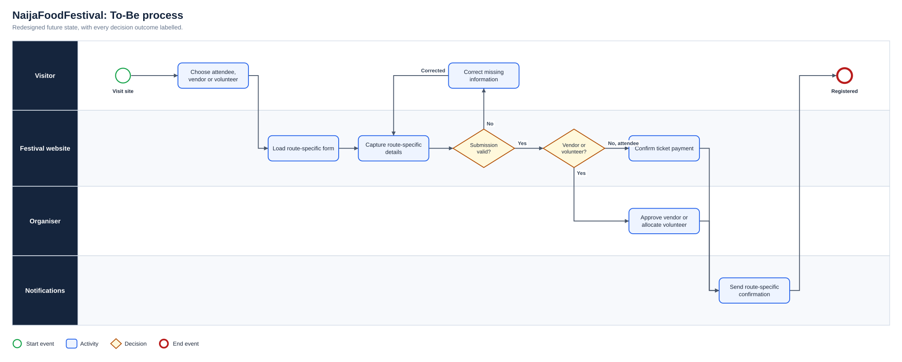
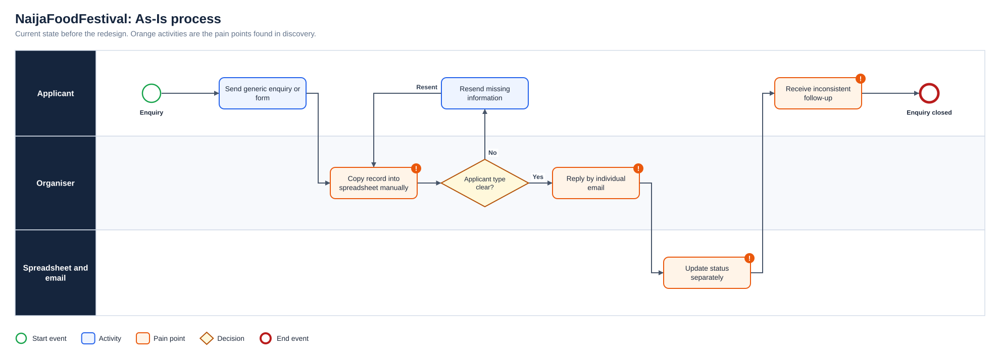
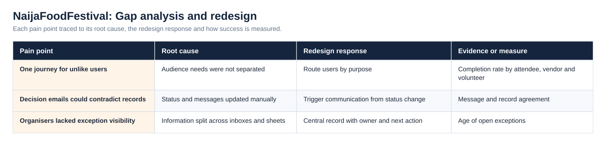
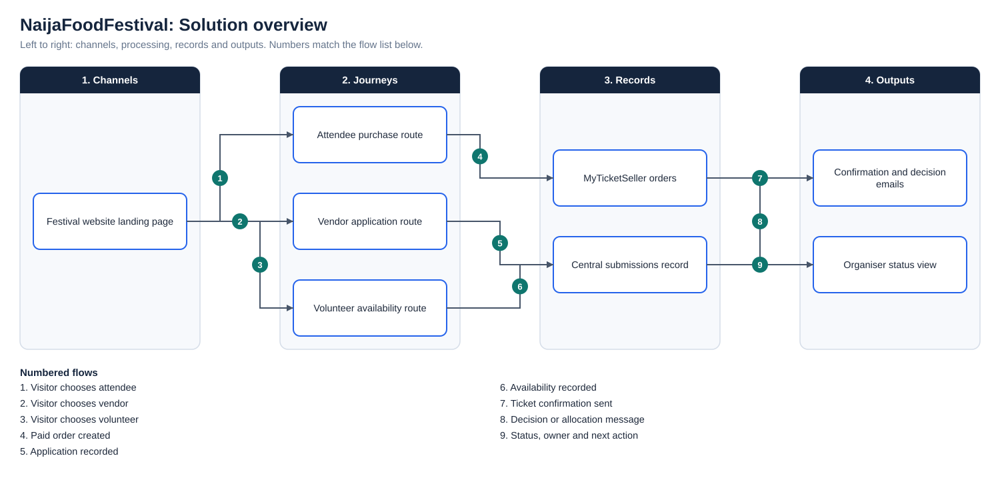

# NaijaFoodFestival: Multi-user Registration Service

**Status:** Delivered  
**Business domain:** Events and hospitality  
**Solution domain:** Service design, workflow automation and digital delivery  
**Role:** Digital Project Manager / Business Analyst

## Executive summary

The initial request was for a registration website. Discovery showed that this was not one journey: attendees, vendors and volunteers required different information, decisions, approvals, communications and operational hand-offs.

Treating every user as part of a single registration process would have created incomplete data, confusing communications and unnecessary administrative work. I separated the service into three journeys and translated each into pages, forms, records, ticketing rules, automated emails and reporting needs.

## Users and needs

| User | Primary need | Operational requirement |
|---|---|---|
| Attendee | Discover, register or purchase and receive confirmation | Accurate ticket and communication record |
| Vendor | Apply, supply business information and receive a decision | Review, approval and onboarding workflow |
| Volunteer | Apply, declare availability and receive instructions | Screening, allocation and coordination workflow |
| Organiser | Monitor status and intervene where required | Consolidated, accurate operational data |

## To-be service

The As-Is process and the full diagram set are shown under Diagrams below.

## BA contribution

- Facilitated discovery with organisers and delivery colleagues
- Mapped as-is information flows and missing hand-offs
- Defined separate to-be journeys and data requirements
- Converted journeys into functional requirements and acceptance criteria
- Organised work using Airtable and Monday.com
- Connected forms, records and communications using automation tools
- Tested registration, ticket purchase, confirmation and notification journeys
- Logged issues, clarified expected behaviour and retested corrections

## Key lesson

Effective business analysis is not simply producing documentation. It creates a common evidence base that allows organisers, developers and creatives to make aligned decisions before problems reach live users.

## Supporting artefact

- [Business Analysis Pack](BUSINESS_ANALYSIS_PACK.md)

## Diagrams

**To-Be process**

**As-Is process**

**Gap analysis and redesign**

**Solution overview**

## Project artefact library

| Artefact | Purpose |
|---|---|
| [Executive deck (PDF)](Deck/Executive_Deck.pdf) | Problem, discovery findings, As-Is and To-Be, change summary, evidence and recommendations |
| [Executive deck (PowerPoint)](Deck/Executive_Deck.pptx) | Editable version of the deck |
| [Business Requirements Document](Docs/BRD.pdf) | Objectives, scope, business requirements, assumptions, constraints and risks |
| [Functional Requirements Document](Docs/FRD.pdf) | System behaviour, business rules, user stories and non-functional requirements |
| [Requirements Traceability Matrix](Docs/Requirements_Traceability_Matrix.pdf) | Objective to requirement to functional requirement, user story and test |
| [UAT and Validation Plan](Docs/UAT_and_Validation_Plan.pdf) | Given, When, Then scenarios with status and exit criteria |
| [Stakeholder Engagement Plan](Docs/Stakeholder_Engagement_Plan.pdf) and [Communications Plan](Docs/Communications_Plan.pdf) | Influence and interest analysis, methods and cadence |
| [MoSCoW Prioritisation](Docs/MoSCoW_Prioritisation.pdf) | Must, Should, Could and Won’t with rationale |
| [Data Dictionary](Docs/Data_Dictionary.pdf) | Field definitions and allowed values ([CSV](Data/Data_Dictionary.csv)) |
| [Project workbook](Excel/Project_Workbook.xlsx) | Requirements, functional requirements, stories, stakeholders, RAID, UAT and traceability, with formula-driven counts |
| [Evidence overview](Dashboard/Project_Evidence_Overview.png) | Requirements by priority, tests by status and risks by severity |
