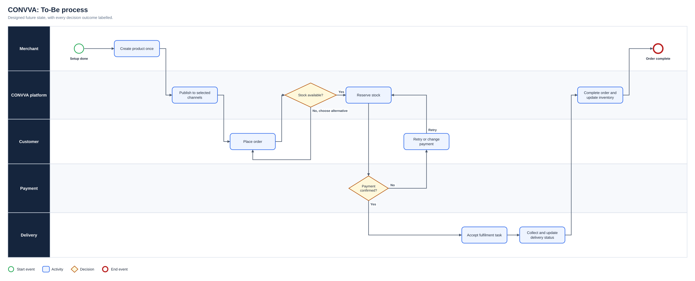
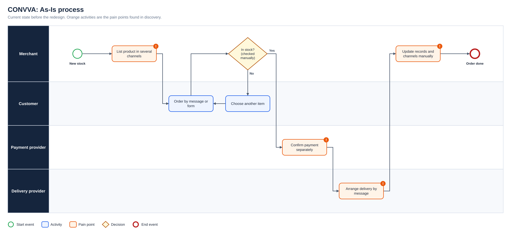
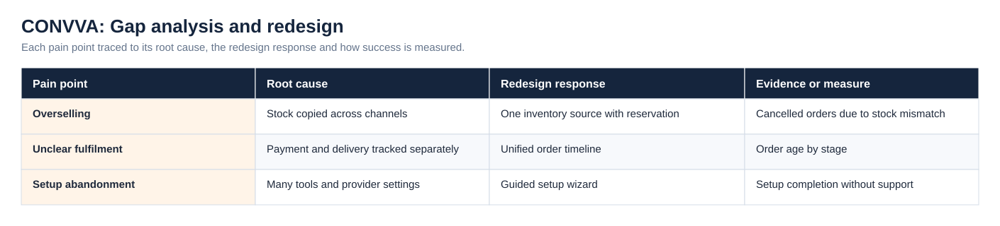
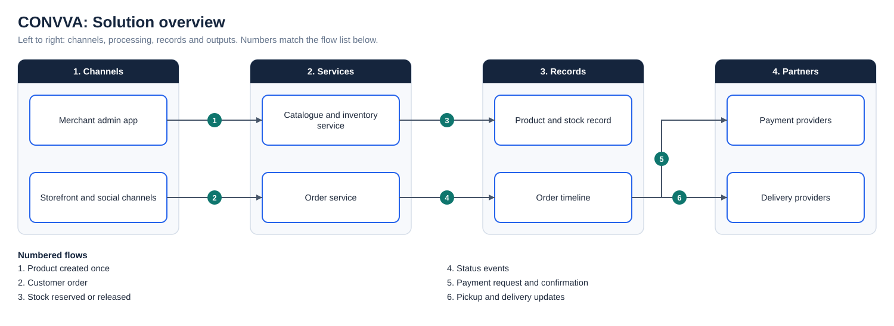

# CONVVA: Sell-anywhere Commerce for African SMEs

**Status:** Concept/MVP design  
**Business domain:** SME commerce and retail technology  
**Solution domain:** Product discovery and omnichannel service design  
**Role:** Founder / Product Business Analyst

## Vision

CONVVA is designed to help African SMEs sell through a connected operating system for storefronts, payments, inventory, orders and delivery.

## Problem

Small merchants often manage products and orders across social media, messaging, spreadsheets and separate payment or delivery tools. This can create duplicate records, overselling, unclear fulfilment status and limited performance visibility.

## MVP journey

1. Configure a sample store.
2. Add products and inventory.
3. Select selling channels.
4. Receive and manage orders.
5. Coordinate payment and delivery status.
6. Preview the resulting storefront and operational view.

The As-Is process and the full diagram set are shown under Diagrams below.

## Core requirements

- One product and inventory record across selected channels
- Clear order status and ownership
- Configurable payment and delivery options
- Mobile-responsive merchant and customer journeys
- Exceptions for failed payment, unavailable stock and delivery changes
- Simple reporting suitable for SME decision-making

## Discovery questions

- Which channel causes the most operational duplication?
- How frequently do merchants update stock manually?
- Which payment and logistics providers are most important at launch?
- What level of setup can merchants complete without support?
- Which capabilities create enough value for paid adoption?

## Diagrams

**To-Be process**

**As-Is process**

**Gap analysis and redesign**

**Solution overview**

## Project artefact library

| Artefact | Purpose |
|---|---|
| [Executive deck (PDF)](Deck/Executive_Deck.pdf) | Problem, discovery findings, As-Is and To-Be, change summary, evidence and recommendations |
| [Executive deck (PowerPoint)](Deck/Executive_Deck.pptx) | Editable version of the deck |
| [Business Requirements Document](Docs/BRD.pdf) | Objectives, scope, business requirements, assumptions, constraints and risks |
| [Functional Requirements Document](Docs/FRD.pdf) | System behaviour, business rules, user stories and non-functional requirements |
| [Requirements Traceability Matrix](Docs/Requirements_Traceability_Matrix.pdf) | Objective to requirement to functional requirement, user story and test |
| [UAT and Validation Plan](Docs/UAT_and_Validation_Plan.pdf) | Given, When, Then scenarios with status and exit criteria |
| [Stakeholder Engagement Plan](Docs/Stakeholder_Engagement_Plan.pdf) and [Communications Plan](Docs/Communications_Plan.pdf) | Influence and interest analysis, methods and cadence |
| [MoSCoW Prioritisation](Docs/MoSCoW_Prioritisation.pdf) | Must, Should, Could and Won’t with rationale |
| [Data Dictionary](Docs/Data_Dictionary.pdf) | Field definitions and allowed values ([CSV](Data/Data_Dictionary.csv)) |
| [Project workbook](Excel/Project_Workbook.xlsx) | Requirements, functional requirements, stories, stakeholders, RAID, UAT and traceability, with formula-driven counts |
| [Evidence overview](Dashboard/Project_Evidence_Overview.png) | Requirements by priority, tests by status and risks by severity |
