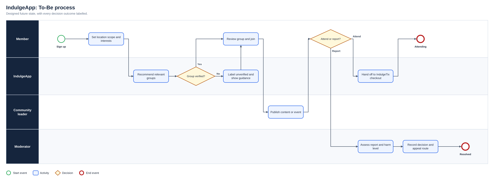
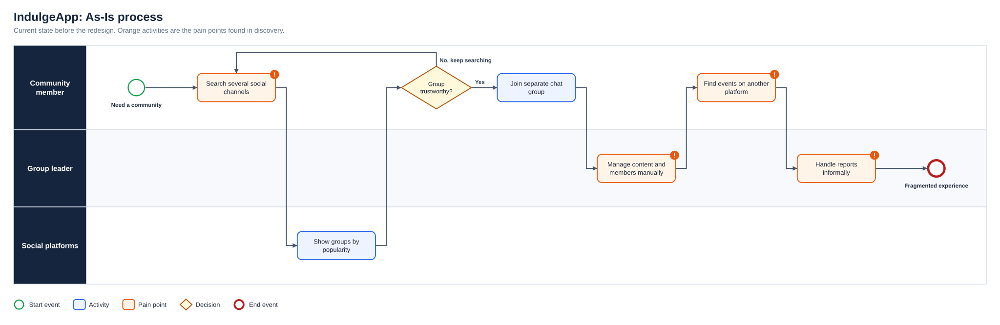
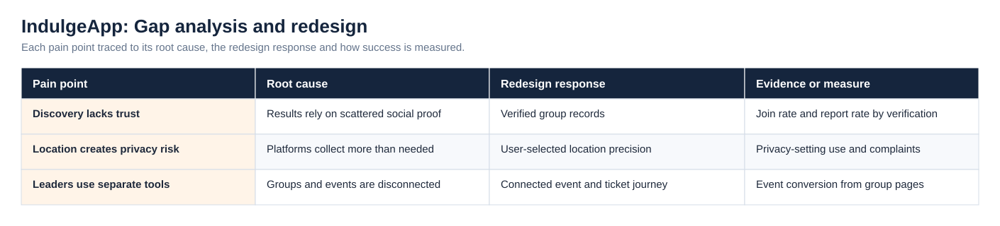
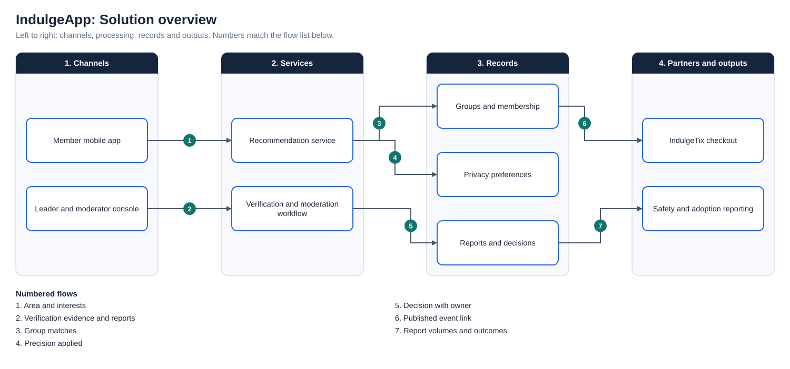

# IndulgeApp: Community-as-a-Service for the Diaspora

**Status:** Concept/MVP design  
**Business domain:** Community technology and diaspora services  
**Solution domain:** Product discovery and user-centred service design

## Opportunity

Immigrants, students and residents often discover communities, events and trusted local information through fragmented social channels. Group leaders also have limited tools for discovery, membership engagement, events and sustainable monetisation.

## Proposed capabilities

- Location-aware community feed
- Verified group discovery
- Group membership and engagement
- Built-in ticketing through IndulgeTix
- Community-leader monetisation
- Localised content and recommendations

## Primary BA questions

- What establishes trust for a community or group?
- Which location data is necessary and proportionate?
- How should users control visibility and notifications?
- Where does community discovery end and ticketing begin?
- Which moderation and escalation controls are required?

## Success measures

Activated users · group joins · repeat engagement · event conversion · verified-group adoption · reports resolved

## Diagrams

**To-Be process**

**As-Is process**

**Gap analysis and redesign**

**Solution overview**

## Project artefact library

| Artefact | Purpose |
|---|---|
| [Executive deck (PDF)](Deck/Executive_Deck.pdf) | Problem, discovery findings, As-Is and To-Be, change summary, evidence and recommendations |
| [Executive deck (PowerPoint)](Deck/Executive_Deck.pptx) | Editable version of the deck |
| [Business Requirements Document](Docs/BRD.pdf) | Objectives, scope, business requirements, assumptions, constraints and risks |
| [Functional Requirements Document](Docs/FRD.pdf) | System behaviour, business rules, user stories and non-functional requirements |
| [Requirements Traceability Matrix](Docs/Requirements_Traceability_Matrix.pdf) | Objective to requirement to functional requirement, user story and test |
| [UAT and Validation Plan](Docs/UAT_and_Validation_Plan.pdf) | Given, When, Then scenarios with status and exit criteria |
| [Stakeholder Engagement Plan](Docs/Stakeholder_Engagement_Plan.pdf) and [Communications Plan](Docs/Communications_Plan.pdf) | Influence and interest analysis, methods and cadence |
| [MoSCoW Prioritisation](Docs/MoSCoW_Prioritisation.pdf) | Must, Should, Could and Won’t with rationale |
| [Data Dictionary](Docs/Data_Dictionary.pdf) | Field definitions and allowed values ([CSV](Data/Data_Dictionary.csv)) |
| [Project workbook](Excel/Project_Workbook.xlsx) | Requirements, functional requirements, stories, stakeholders, RAID, UAT and traceability, with formula-driven counts |
| [Evidence overview](Dashboard/Project_Evidence_Overview.png) | Requirements by priority, tests by status and risks by severity |
