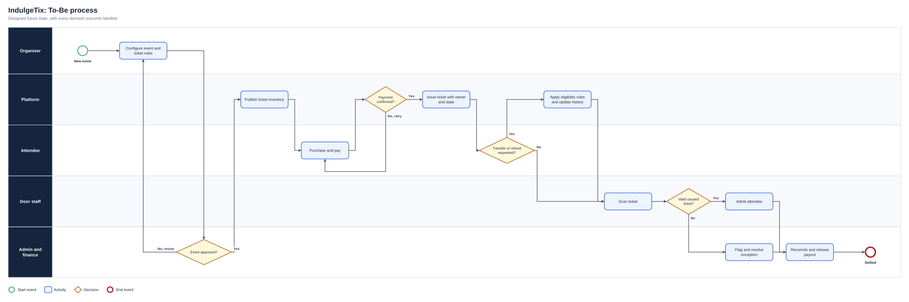
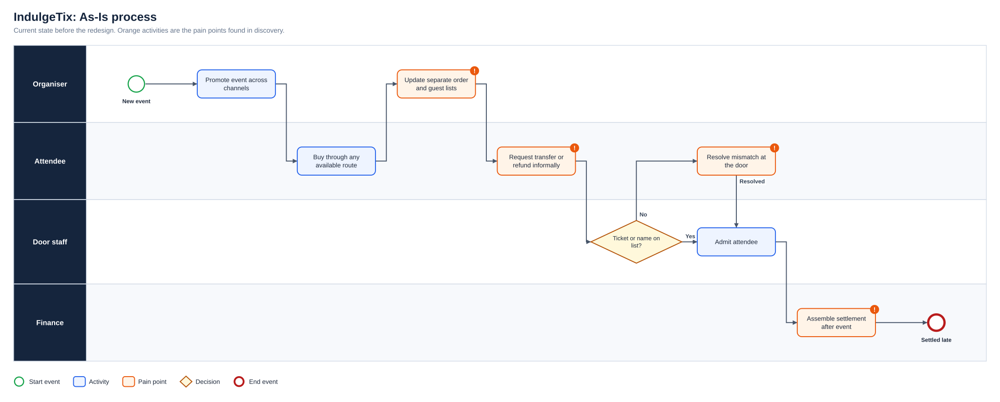
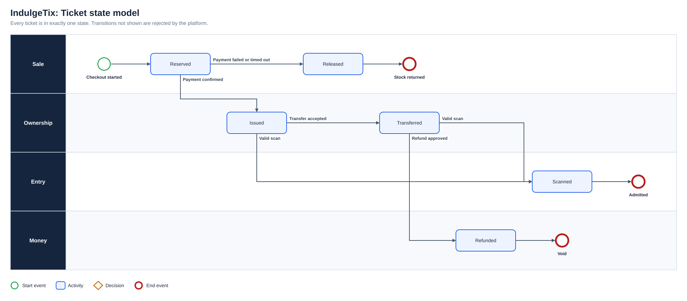
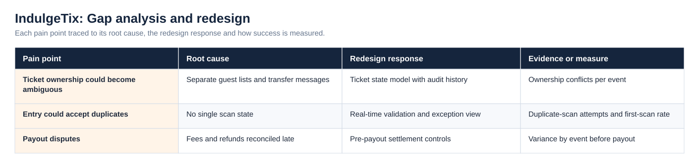
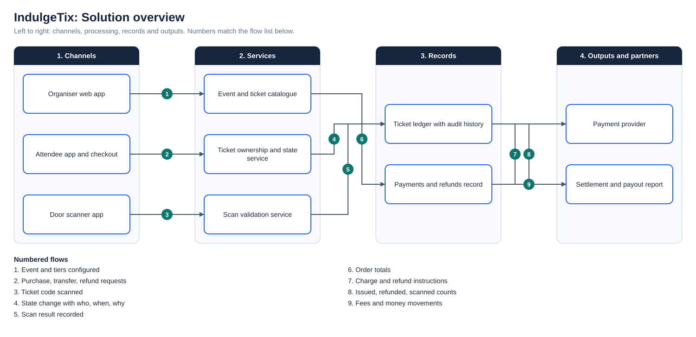

# IndulgeTix: Event Ticketing and Marketing Platform

**Status:** Product development  
**Business domain:** Event technology and payments  
**Solution domain:** Product discovery, requirements engineering and service design  
**Role:** Founder / Product Business Analyst

## Product problem

Event organisers need more than ticket checkout. They require event setup, ticket types, promotion, access control, scanning, guest management, affiliate sales, settlements, refunds and performance visibility. Attendees need a reliable way to purchase, receive, transfer and manage tickets.

## User groups

- Attendees
- Organisers and event teams
- Affiliate resellers
- Door/scanning staff
- Platform administrators
- Finance and compliance reviewers

## Defined capabilities

- Paid, free and invite-only events
- Single, recurring and multi-day events
- User, organiser and administrator dashboards
- Transfer Ticket
- Stress-Free Tickets with protection/resale concepts
- Squad Pass
- Affiliate reseller journeys
- Complimentary and referral codes
- Guest-list CSV management
- Built-in advertising and email tools
- Scanning and attendance controls
- Approval, payout, refund, transfer and compliance administration
- Performance and settlement analytics

## Service flow

The As-Is process and the full diagram set are shown under Diagrams below.

## BA focus

The product work separates business rules from interface ideas. Requirements are organised around user goals, permissions, money movement, exception handling and auditability. Complex areas, including ticket transfer, resale protection, refunds, scanning and settlements, require explicit state models and acceptance criteria rather than only page designs.

## Key controls

- A ticket must have a single valid ownership state.
- Transfer and resale actions must preserve audit history.
- Scan status must prevent unintended duplicate entry.
- Payout status must reconcile with ticket, refund and fee records.
- Administrator actions must be permission-controlled.

## Planned measures

Purchase completion · scan success · support contacts · transfer success · refund resolution · settlement variance · organiser retention

## Diagrams

**To-Be process**

**As-Is process**

**Ticket state model**

**Gap analysis and redesign**

**Solution overview**

## Project artefact library

| Artefact | Purpose |
|---|---|
| [Executive deck (PDF)](Deck/Executive_Deck.pdf) | Problem, discovery findings, As-Is and To-Be, change summary, evidence and recommendations |
| [Executive deck (PowerPoint)](Deck/Executive_Deck.pptx) | Editable version of the deck |
| [Business Requirements Document](Docs/BRD.pdf) | Objectives, scope, business requirements, assumptions, constraints and risks |
| [Functional Requirements Document](Docs/FRD.pdf) | System behaviour, business rules, user stories and non-functional requirements |
| [Requirements Traceability Matrix](Docs/Requirements_Traceability_Matrix.pdf) | Objective to requirement to functional requirement, user story and test |
| [UAT and Validation Plan](Docs/UAT_and_Validation_Plan.pdf) | Given, When, Then scenarios with status and exit criteria |
| [Stakeholder Engagement Plan](Docs/Stakeholder_Engagement_Plan.pdf) and [Communications Plan](Docs/Communications_Plan.pdf) | Influence and interest analysis, methods and cadence |
| [MoSCoW Prioritisation](Docs/MoSCoW_Prioritisation.pdf) | Must, Should, Could and Won’t with rationale |
| [Data Dictionary](Docs/Data_Dictionary.pdf) | Field definitions and allowed values ([CSV](Data/Data_Dictionary.csv)) |
| [Project workbook](Excel/Project_Workbook.xlsx) | Requirements, functional requirements, stories, stakeholders, RAID, UAT and traceability, with formula-driven counts |
| [Evidence overview](Dashboard/Project_Evidence_Overview.png) | Requirements by priority, tests by status and risks by severity |
