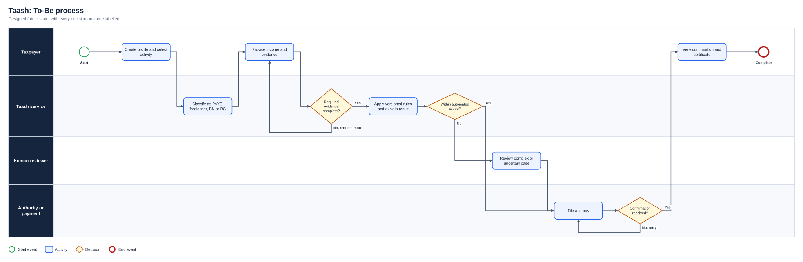
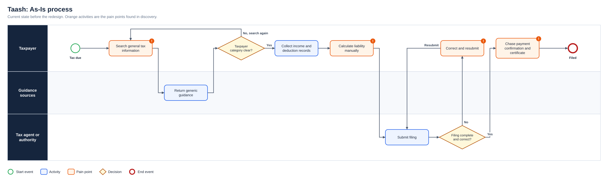
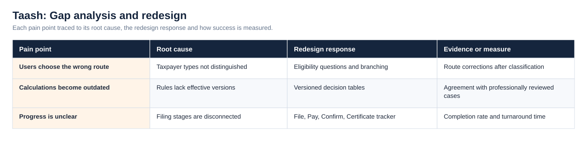
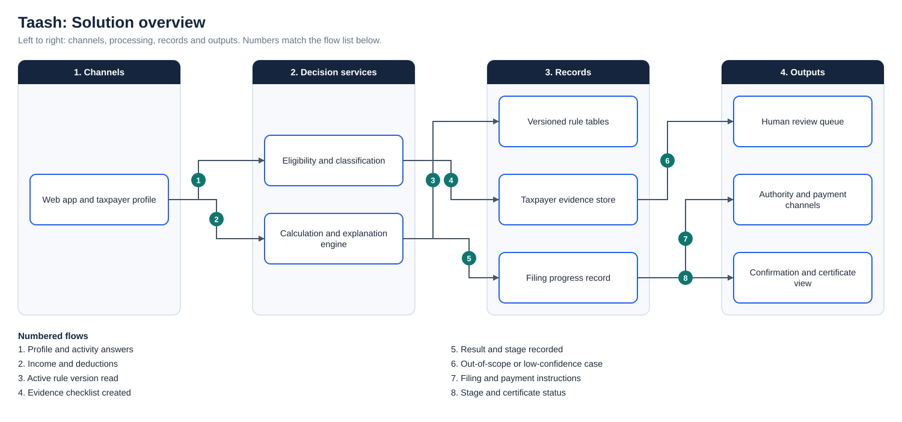

# Taash: Tax Automation Service

**Status:** In development  
**Business domain:** Tax technology and financial services  
**Solution domain:** Product discovery, rules analysis and workflow automation  
**Role:** Founder / Product Business Analyst

## Executive summary

Taash is a Nigeria-first tax-assistance product designed to reduce the complexity of understanding, preparing and completing common tax obligations. The product translates tax rules and filing stages into guided user journeys for individuals, freelancers and businesses.

The analytical challenge is that users do not begin with the same legal status, income type, deductions or filing authority. A single calculator or undifferentiated form could produce confusing or inappropriate outputs. The service therefore requires clear segmentation, transparent calculation logic, controlled content and traceable decisions.

## Problem statement

Users may struggle to determine:

- which tax route applies to them;
- what information and evidence they must provide;
- which deductions or reliefs may be relevant;
- whether a business files through a state or federal route;
- what happens after a return is prepared;
- how payment, confirmation and certification connect.

## Service model

The operating journey is summarised as:

> **File → Pay → Confirm → Certificate**

The As-Is process and the full diagram set are shown under Diagrams below.

## Stakeholders and users

| Group | Need |
|---|---|
| Employees/PAYE users | Understand income, reliefs, deductions and filing position |
| Freelancers | Separate income, allowable costs and personal tax obligations |
| Business-name owners | Follow the appropriate state route |
| Registered companies | Follow applicable federal/company obligations |
| Tax professionals/agents | Review calculations, evidence and status |
| Tax authorities | Receive accurate, complete and traceable information |
| Product/engineering team | Implement unambiguous rules with version control |

## Analysis performed

- Segmented user journeys by taxpayer and entity type
- Mapped the end-to-end filing and confirmation process
- Converted policy concepts into decision rules and data requirements
- Defined guided content for TIN, deductions, reforms and filing steps
- Structured product requirements for BN, company and individual routes
- Identified compliance, privacy, versioning and explanation risks
- Planned Sanity CMS and Next.js content architecture

## Key rules currently represented in product analysis

The PAYE and freelancer rules follow the Nigeria Tax Act 2025, in force from 1 January 2026. The Act abolished the old consolidated relief allowance, so the relief model now uses **rent relief of 20% of annual rent, capped at ₦500,000**, and a **0% band on the first ₦800,000 of chargeable income**, alongside deductions such as pension, NHF, NHIS and qualifying donations. Retiring the CRA rules was handled as a versioned rule change (OBJ-03), which is the scenario the effective-date design exists for. All rules remain configurable product logic that needs professional and regulatory validation before production use.

## Product principles

1. **Explain before calculating:** users should understand why information is requested.
2. **Show the rule applied:** calculations must be traceable and reviewable.
3. **Separate guidance from advice:** the service must state its limitations clearly.
4. **Version controlled content:** rule and guidance changes require dates and ownership.
5. **Human escalation:** complex or uncertain cases must be referred appropriately.

## Supporting artefacts

- [Business Analysis Pack](BUSINESS_ANALYSIS_PACK.md)
- [Decision Rules and Traceability](DECISION_RULES_AND_TRACEABILITY.md)

## Diagrams

**To-Be process**

**As-Is process**

**Gap analysis and redesign**

**Solution overview**

## Project artefact library

| Artefact | Purpose |
|---|---|
| [Executive deck (PDF)](Deck/Executive_Deck.pdf) | Problem, discovery findings, As-Is and To-Be, change summary, evidence and recommendations |
| [Executive deck (PowerPoint)](Deck/Executive_Deck.pptx) | Editable version of the deck |
| [Business Requirements Document](Docs/BRD.pdf) | Objectives, scope, business requirements, assumptions, constraints and risks |
| [Functional Requirements Document](Docs/FRD.pdf) | System behaviour, business rules, user stories and non-functional requirements |
| [Requirements Traceability Matrix](Docs/Requirements_Traceability_Matrix.pdf) | Objective to requirement to functional requirement, user story and test |
| [UAT and Validation Plan](Docs/UAT_and_Validation_Plan.pdf) | Given, When, Then scenarios with status and exit criteria |
| [Stakeholder Engagement Plan](Docs/Stakeholder_Engagement_Plan.pdf) and [Communications Plan](Docs/Communications_Plan.pdf) | Influence and interest analysis, methods and cadence |
| [MoSCoW Prioritisation](Docs/MoSCoW_Prioritisation.pdf) | Must, Should, Could and Won’t with rationale |
| [Data Dictionary](Docs/Data_Dictionary.pdf) | Field definitions and allowed values ([CSV](Data/Data_Dictionary.csv)) |
| [Project workbook](Excel/Project_Workbook.xlsx) | Requirements, functional requirements, stories, stakeholders, RAID, UAT and traceability, with formula-driven counts |
| [Evidence overview](Dashboard/Project_Evidence_Overview.png) | Requirements by priority, tests by status and risks by severity |
