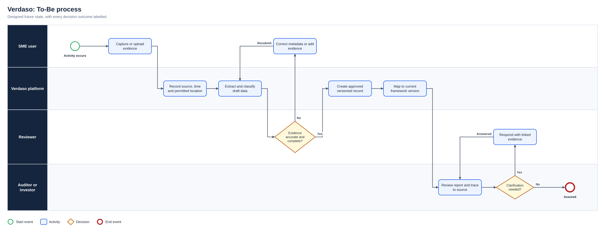
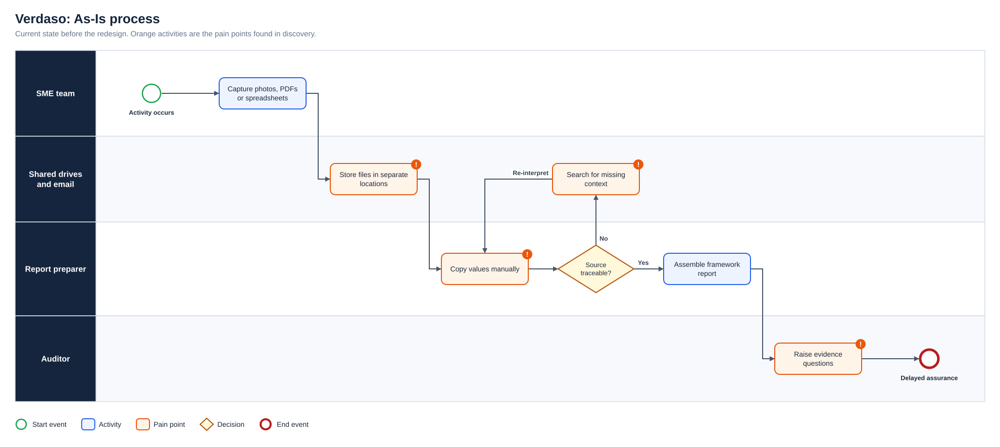
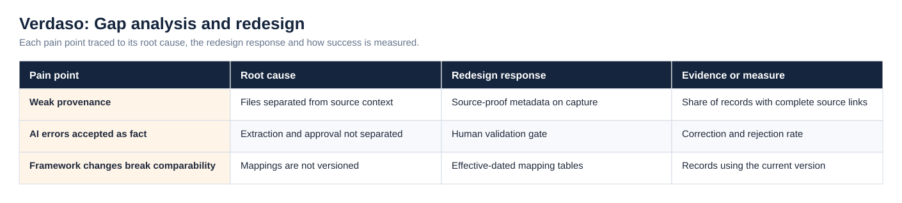
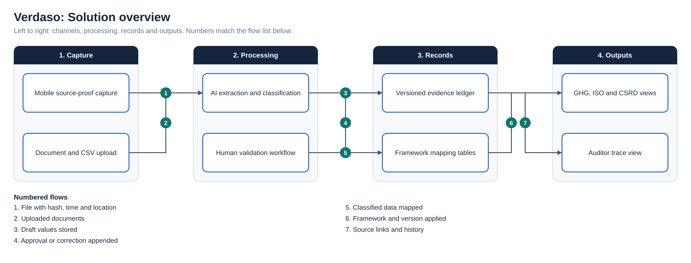

# Verdaso: ESG Evidence Infrastructure

**Status:** Concept/MVP design  
**Business domain:** ESG, compliance and sustainability technology  
**Solution domain:** Evidence management, workflow design and reporting

## Problem

SMEs and emerging-market suppliers may struggle to collect, organise and demonstrate reliable ESG evidence. Information can be scattered across photographs, PDFs and spreadsheets, making audit review and report preparation difficult.

## Concept

Verdaso converts source evidence into controlled records that can support GHG, ISO and CSRD-aligned reporting. Proposed capabilities include document ingestion, source metadata, GPS-enabled “Source Proof,” AI-assisted extraction, immutable evidence references and separate auditor/investor views.

The As-Is process and the full diagram set are shown under Diagrams below.

## Risks requiring analysis

- AI extraction may misclassify evidence.
- GPS data may create privacy or safety risks.
- Immutable records must not prevent lawful correction.
- Reporting frameworks and thresholds can change.
- View-only stakeholders need appropriate access boundaries.

## Product principle

AI may assist evidence processing, but source traceability and human validation must remain visible.

## Diagrams

**To-Be process**

**As-Is process**

**Gap analysis and redesign**

**Solution overview**

## Project artefact library

| Artefact | Purpose |
|---|---|
| [Executive deck (PDF)](Deck/Executive_Deck.pdf) | Problem, discovery findings, As-Is and To-Be, change summary, evidence and recommendations |
| [Executive deck (PowerPoint)](Deck/Executive_Deck.pptx) | Editable version of the deck |
| [Business Requirements Document](Docs/BRD.pdf) | Objectives, scope, business requirements, assumptions, constraints and risks |
| [Functional Requirements Document](Docs/FRD.pdf) | System behaviour, business rules, user stories and non-functional requirements |
| [Requirements Traceability Matrix](Docs/Requirements_Traceability_Matrix.pdf) | Objective to requirement to functional requirement, user story and test |
| [UAT and Validation Plan](Docs/UAT_and_Validation_Plan.pdf) | Given, When, Then scenarios with status and exit criteria |
| [Stakeholder Engagement Plan](Docs/Stakeholder_Engagement_Plan.pdf) and [Communications Plan](Docs/Communications_Plan.pdf) | Influence and interest analysis, methods and cadence |
| [MoSCoW Prioritisation](Docs/MoSCoW_Prioritisation.pdf) | Must, Should, Could and Won’t with rationale |
| [Data Dictionary](Docs/Data_Dictionary.pdf) | Field definitions and allowed values ([CSV](Data/Data_Dictionary.csv)) |
| [Project workbook](Excel/Project_Workbook.xlsx) | Requirements, functional requirements, stories, stakeholders, RAID, UAT and traceability, with formula-driven counts |
| [Evidence overview](Dashboard/Project_Evidence_Overview.png) | Requirements by priority, tests by status and risks by severity |
