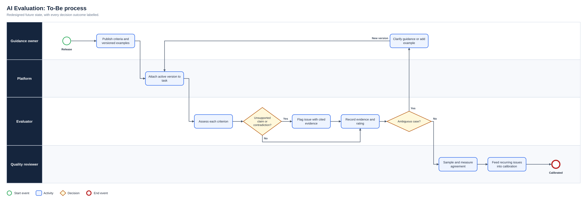
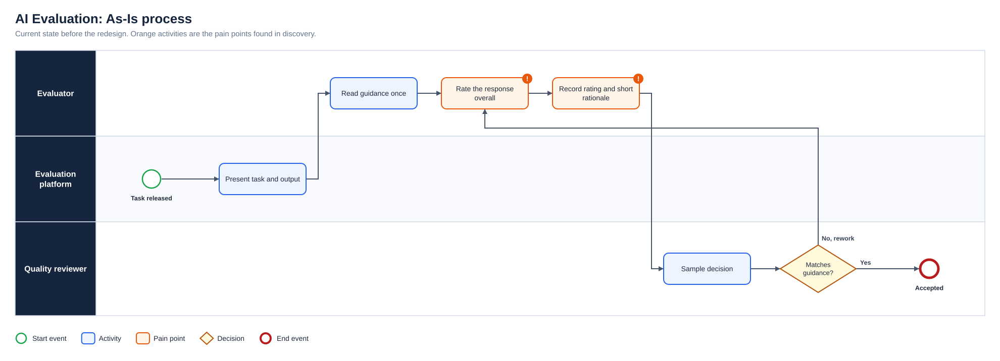
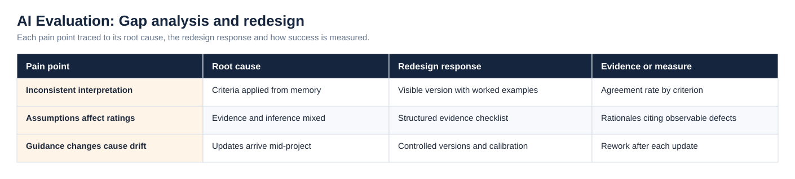
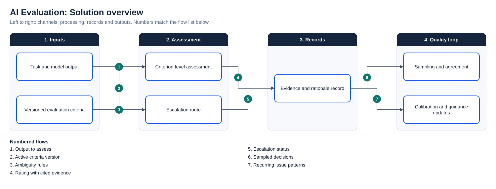

# AI Evaluation: Evidence, Quality and Consistent Judgement

**Status:** Delivered evaluation work  
**Business domain:** Artificial intelligence services  
**Solution domain:** Quality analysis, rules interpretation and evidence-based decision-making  
**Platforms:** Mercor and Outlier

## Work performed

I assessed AI outputs against detailed criteria including factual accuracy, completeness, reasoning quality and instruction adherence. The work required distinguishing evidence from unsupported assumptions, identifying contradictions and explaining the basis for decisions.

## Transferable BA capabilities

- Interpret complex and evolving guidance
- Apply criteria consistently across repeated cases
- Document rationale and exceptions
- Identify ambiguity and unsupported assumptions
- Adapt when rules change without losing quality control
- Separate observation, inference and conclusion

## Quality workflow

The As-Is process and the full diagram set are shown under Diagrams below.

Client datasets, prompts and protected evaluation guidance are not reproduced.

## Diagrams

**To-Be process**

**As-Is process**

**Gap analysis and redesign**

**Solution overview**

## Project artefact library

| Artefact | Purpose |
|---|---|
| [Executive deck (PDF)](Deck/Executive_Deck.pdf) | Problem, discovery findings, As-Is and To-Be, change summary, evidence and recommendations |
| [Executive deck (PowerPoint)](Deck/Executive_Deck.pptx) | Editable version of the deck |
| [Business Requirements Document](Docs/BRD.pdf) | Objectives, scope, business requirements, assumptions, constraints and risks |
| [Functional Requirements Document](Docs/FRD.pdf) | System behaviour, business rules, user stories and non-functional requirements |
| [Requirements Traceability Matrix](Docs/Requirements_Traceability_Matrix.pdf) | Objective to requirement to functional requirement, user story and test |
| [UAT and Validation Plan](Docs/UAT_and_Validation_Plan.pdf) | Given, When, Then scenarios with status and exit criteria |
| [Stakeholder Engagement Plan](Docs/Stakeholder_Engagement_Plan.pdf) and [Communications Plan](Docs/Communications_Plan.pdf) | Influence and interest analysis, methods and cadence |
| [MoSCoW Prioritisation](Docs/MoSCoW_Prioritisation.pdf) | Must, Should, Could and Won’t with rationale |
| [Data Dictionary](Docs/Data_Dictionary.pdf) | Field definitions and allowed values ([CSV](Data/Data_Dictionary.csv)) |
| [Project workbook](Excel/Project_Workbook.xlsx) | Requirements, functional requirements, stories, stakeholders, RAID, UAT and traceability, with formula-driven counts |
| [Evidence overview](Dashboard/Project_Evidence_Overview.png) | Requirements by priority, tests by status and risks by severity |
