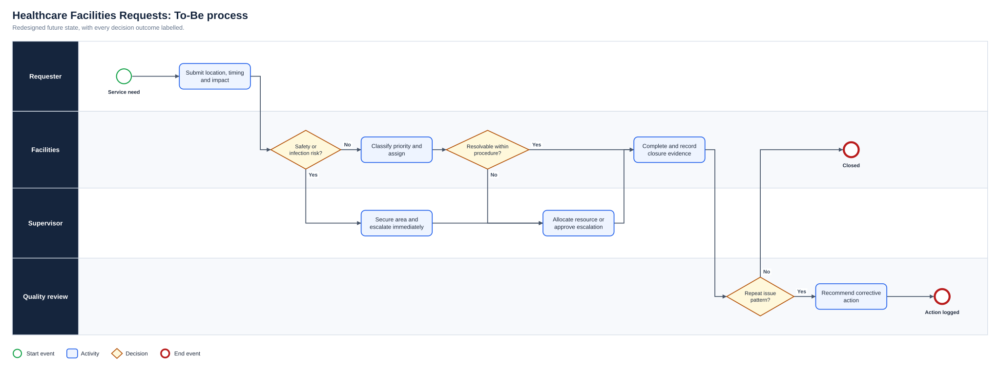
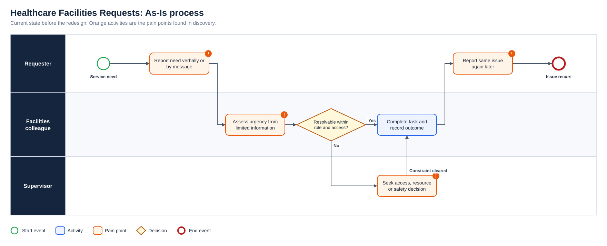
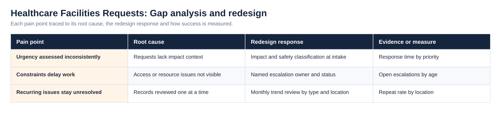
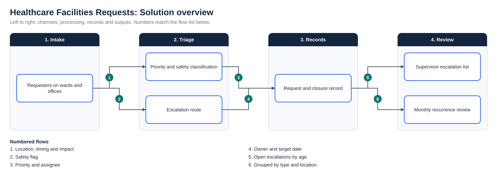

# Healthcare Facilities Request Handling: Generalised Process Analysis

**Status:** Generalised operational analysis  
**Business domain:** Healthcare support services  
**Solution domain:** Service operations, quality and continuous improvement

## Context

Facilities teams in healthcare settings receive requests from clinical and administrative colleagues. Work must be prioritised by safety and infection-prevention impact, carried out within procedure and recorded so that supervisors and quality reviewers can act on patterns.

This is a generalised analysis of how such a service can be structured. It does not describe any specific organisation, site or internal procedure.

## Problem

Facilities requests in a healthcare setting can arrive without impact context, stall on access or resource constraints, and recur without anyone seeing the pattern.

## What the analysis found

- Requests often lack location, timing or impact detail
- Access and resource constraints are not visible to supervisors
- Recurring issues are handled one at a time

## Requirements

| ID | Requirement | Priority | Objective | Acceptance criterion |
|---|---|---|---|---|
| BR-01 | Requests record location, timing and impact | Must | OBJ-01 | Required facts are present before work is assigned |
| BR-02 | Safety and infection risks are prioritised immediately | Must | OBJ-02 | High-risk requests are escalated at intake |
| BR-03 | Access and resource constraints have a named owner | Must | OBJ-03 | Escalation owner and status are visible |
| BR-04 | Closure evidence is retained | Should | OBJ-01 | Closure is recorded consistently |
| BR-05 | Recurring issues can be identified | Should | OBJ-04 | Records can be grouped by type and location |

## Integrity note

No patient, staff, site or organisation-identifying information is included. Measures are illustrative and would be checked against local standards.

## Diagrams

**To-Be process**

**As-Is process**

**Gap analysis and redesign**

**Solution overview**

## Project artefact library

| Artefact | Purpose |
|---|---|
| [Executive deck (PDF)](Deck/Executive_Deck.pdf) | Problem, discovery findings, As-Is and To-Be, change summary, evidence and recommendations |
| [Executive deck (PowerPoint)](Deck/Executive_Deck.pptx) | Editable version of the deck |
| [Business Requirements Document](Docs/BRD.pdf) | Objectives, scope, business requirements, assumptions, constraints and risks |
| [Functional Requirements Document](Docs/FRD.pdf) | System behaviour, business rules, user stories and non-functional requirements |
| [Requirements Traceability Matrix](Docs/Requirements_Traceability_Matrix.pdf) | Objective to requirement to functional requirement, user story and test |
| [UAT and Validation Plan](Docs/UAT_and_Validation_Plan.pdf) | Given, When, Then scenarios with status and exit criteria |
| [Stakeholder Engagement Plan](Docs/Stakeholder_Engagement_Plan.pdf) and [Communications Plan](Docs/Communications_Plan.pdf) | Influence and interest analysis, methods and cadence |
| [MoSCoW Prioritisation](Docs/MoSCoW_Prioritisation.pdf) | Must, Should, Could and Won’t with rationale |
| [Data Dictionary](Docs/Data_Dictionary.pdf) | Field definitions and allowed values ([CSV](Data/Data_Dictionary.csv)) |
| [Project workbook](Excel/Project_Workbook.xlsx) | Requirements, functional requirements, stories, stakeholders, RAID, UAT and traceability, with formula-driven counts |
| [Evidence overview](Dashboard/Project_Evidence_Overview.png) | Requirements by priority, tests by status and risks by severity |
